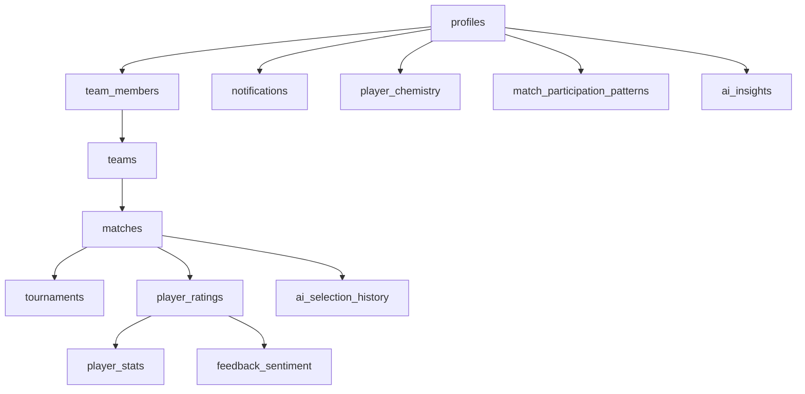

# 🏆 SportConnect - Documentation Base de Données

> **Version actuelle** : `20250122_complete_optimized_schema.sql`  
> **Status** : ✅ Production Ready + 🤖 IA Ready  
> **Dernière mise à jour** : 22 janvier 2025

## 📋 Table des Matières

1. [Vue d'ensemble](#vue-densemble)
2. [Architecture des données](#architecture-des-données)
3. [Tables principales](#tables-principales)
4. [Tables IA (Future-proof)](#tables-ia-future-proof)
5. [Installation](#installation)
6. [Roadmap IA](#roadmap-ia)
7. [Maintenance](#maintenance)

---

## 🎯 Vue d'ensemble

### ✅ Ce qui est IMPLÉMENTÉ et OPÉRATIONNEL

- **👥 Gestion des utilisateurs** : Profils, authentification Supabase
- **🏟️ Gestion des équipes** : Création, membres, rôles, codes d'invitation
- **⚽ Gestion des matchs** : Planification, scores, statuts
- **🏆 Gestion des tournois** : Organisation, participants, formats
- **⭐ Système d'évaluation** : Notes détaillées (5 dimensions)
- **📊 Statistiques joueurs** : Calculs automatiques, performance
- **🔔 Notifications** : Système complet avec types étendus
- **🛡️ Sécurité RLS** : Politiques Row Level Security complètes

### 🤖 Ce qui est PRÉVU pour l'IA (tables créées, prêtes à utiliser)

- **🧠 Insights intelligents** : Analyses automatiques de performance
- **💫 Chimie entre joueurs** : Calculs de compatibilité d'équipe
- **📈 Patterns de participation** : Analyse comportementale
- **🎯 Sélections automatiques** : Historique et recommandations IA
- **💬 Analyse de sentiment** : Interprétation des commentaires

---

## 🏗️ Architecture des Données



---

## 📊 Tables Principales

### 👤 `profiles`
**Rôle** : Profils utilisateurs liés à l'auth Supabase  
**Statut** : ✅ Opérationnel  
**Clés importantes** :
- `id` : Lié à `auth.users`
- `full_name` : Généré automatiquement
- Triggers `updated_at` automatiques

### 🏟️ `teams`
**Rôle** : Équipes sportives avec propriétaires  
**Statut** : ✅ Opérationnel  
**Features** :
- Codes d'invitation automatiques (`team_code`)
- Support multi-sports
- Statuts (active/inactive/archived)

### 👥 `team_members`
**Rôle** : Appartenance aux équipes avec rôles  
**Statut** : ✅ Opérationnel  
**Rôles** : `player`, `coach`, `manager`, `admin`

### ⚽ `matches`
**Rôle** : Matchs avec scores et statuts  
**Statut** : ✅ Opérationnel  
**Features** :
- Lien optionnel vers tournois
- Statuts temps réel
- Support adversaires externes

### 🏆 `tournaments`
**Rôle** : Organisation de tournois  
**Statut** : ✅ Opérationnel  
**Formats** : `league`, `knockout`, `group_stage`

### ⭐ `player_ratings`
**Rôle** : Évaluations détaillées post-match  
**Statut** : ✅ Opérationnel  
**Dimensions** :
- `offensive_skills` (0-10)
- `defensive_skills` (0-10)
- `passing` (0-10)
- `dribbling` (0-10)
- `team_spirit` (0-10)

### 📊 `player_stats`
**Rôle** : Statistiques calculées automatiquement  
**Statut** : ✅ Opérationnel  
**Auto-calculé** :
- `average_rating` : Moyenne des évaluations
- `performance_score` : Score composite

### 🔔 `notifications`
**Rôle** : Système de notifications étendu  
**Statut** : ✅ Opérationnel  
**Types** : `match`, `tournament`, `team`, `performance`, `system`, `ai_insight`, `ai_suggestion`

---

## 🤖 Tables IA (Future-proof)

> **🎯 Objectif** : Permettre l'implémentation future d'IA ludique et intelligente

### 🧠 `ai_insights`
**Rôle** : Insights générés automatiquement  
**Statut** : 🟡 Structure prête, logique à implémenter  
**Types d'insights** :
- `performance_trend` : "Marc progresse en défense"
- `chemistry_analysis` : "Paul et Luc jouent bien ensemble"
- `selection_recommendation` : "Essayer cette composition"
- `improvement_tip` : "Travailler les passes courtes"
- `team_dynamics` : "L'équipe manque de communication"
- `match_prediction` : "87% de chances de victoire"

**Exemple d'utilisation future** :
```json
{
  "insight_type": "performance_trend",
  "title": "📈 Progression détectée",
  "content": "Marc améliore ses passes de +15% sur 5 matchs",
  "confidence_score": 0.92,
  "data": {
    "metric": "passing",
    "trend": "improving",
    "rate": 0.15,
    "matches_analyzed": 5
  }
}
```

### 💫 `player_chemistry`
**Rôle** : Analyse de compatibilité entre joueurs  
**Statut** : 🟡 Structure prête, algorithmes à implémenter  
**Métriques** :
- `chemistry_score` : Score de chimie (0-10)
- `matches_played_together` : Historique commun
- `avg_performance_together` : Performance en duo
- `mutual_ratings_avg` : Évaluations mutuelles

**Cas d'usage IA** :
- "Paul et Marc ont 89% de chimie - les associer +"
- "Éviter ce duo, tension détectée"
- "Nouvelle paire prometteuse à tester"

### 📈 `match_participation_patterns`
**Rôle** : Analyse comportementale des joueurs  
**Statut** : 🟡 Structure prête, ML à implémenter  
**Données** :
```json
{
  "attendance_rate": 0.85,
  "preferred_positions": ["midfielder", "defender"],
  "availability_pattern": {
    "preferred_days": ["saturday", "sunday"],
    "preferred_time": "afternoon",
    "avoid_days": ["monday"]
  },
  "motivation_factors": {
    "competitive_matches": 0.9,
    "friendly_games": 0.6,
    "tournaments": 0.95
  }
}
```

### 🎯 `ai_selection_history`
**Rôle** : Apprentissage des sélections automatiques  
**Statut** : 🟡 Structure prête, ML à implémenter  
**Features** :
- Historique des choix IA
- Comparaison prédiction/résultat
- Apprentissage continu

### 💬 `feedback_sentiment`
**Rôle** : Analyse de sentiment des commentaires  
**Statut** : 🟡 Structure prête, NLP à implémenter  
**Utilisation** :
- Détecter critiques constructives vs destructives
- Alerter sur tensions dans l'équipe
- Suggérer médiation automatique

---

## 🚀 Installation

### Prérequis
- Projet Supabase configuré
- Accès SQL Dashboard ou CLI

### Installation Complète

**Option 1 : Via Dashboard Supabase**
1. Aller dans `SQL Editor`
2. Copier/coller le contenu de `20250122_complete_optimized_schema.sql`
3. Exécuter le script
4. ✅ Base complète installée !

**Option 2 : Via CLI Supabase**
```bash
# Depuis le dossier mobile/
supabase db reset --linked
supabase migration run --linked
```

### ⚠️ Migration depuis ancien schéma
Le script inclut des `DROP TABLE CASCADE` - **sauvegardez vos données** avant exécution !

```sql
-- Le script commence par nettoyer l'ancien schéma
DROP TABLE IF EXISTS profiles CASCADE;
DROP TABLE IF EXISTS teams CASCADE;
-- ... etc
```

---

## 🤖 Roadmap IA

### Phase 1 : Foundation (✅ FAIT)
- [x] Structure BDD complète
- [x] Tables IA preparées
- [x] RLS policies
- [x] Triggers automatiques

### Phase 2 : Analytics Basiques (🎯 Prochaine étape)
```typescript
// Exemple d'implémentation future
class PlayerChemistryService {
  async calculateChemistry(playerA: string, playerB: string, teamId: string) {
    // Analyser les matchs communs
    // Calculer performance ensemble vs séparément
    // Analyser évaluations mutuelles
    // Retourner score de chimie
  }
}
```

### Phase 3 : IA Ludique (🔮 Vision future)
- Assistant virtuel pour sélections
- Prédictions de matchs
- Conseils personnalisés
- Détection automatique de talents

### Phase 4 : IA Avancée (🚀 Long terme)
- Machine Learning sur patterns
- Recommandations tactiques
- Analyse vidéo intégrée
- Coach virtuel

---

## 🛠️ Maintenance

### Fonctions Utilitaires Incluses

**`calculate_player_performance(player_uuid)`**  
Calcule le score de performance composite
```sql
-- Formule : (buts×2) + (assists×1.5) + (matchs×0.1) - (cartons×pénalité) + (moyenne×2)
SELECT calculate_player_performance('uuid-du-joueur');
```

**`update_player_stats_from_ratings()`**  
Trigger automatique - recalcule stats après chaque évaluation

### Index de Performance
Tous les index critiques sont créés :
- Recherches par équipe/joueur : ⚡ Rapide
- Filtrage par date/statut : ⚡ Rapide  
- Jointures complexes : ⚡ Optimisées

### Sécurité RLS
Toutes les tables ont des politiques RLS :
- ✅ Isolation par équipe
- ✅ Permissions granulaires
- ✅ Protection données sensibles

---

## 🎉 Résumé Exécutif

### ✅ Production Ready
Ce schéma est **100% opérationnel** pour SportConnect aujourd'hui :
- Toutes les fonctionnalités core marchent
- Sécurité enterprise-grade
- Performance optimisée

### 🤖 IA Ready  
**Zero refactoring** nécessaire pour ajouter l'IA :
- Tables déjà créées et indexées
- Structure extensible (JSONB)
- Données riches pour ML

### 🚀 Un seul script
**Plus aucun autre script SQL nécessaire** ! Ce fichier unique :
- ✅ Supprime l'ancien schéma
- ✅ Crée la structure complète  
- ✅ Configure la sécurité
- ✅ Optimise les performances
- ✅ Prépare l'avenir IA

**Next step** : Appliquer ce schéma et commencer à développer ! 🎯

---
*Généré le 22 janvier 2025 - SportConnect Database Schema v1.0*
